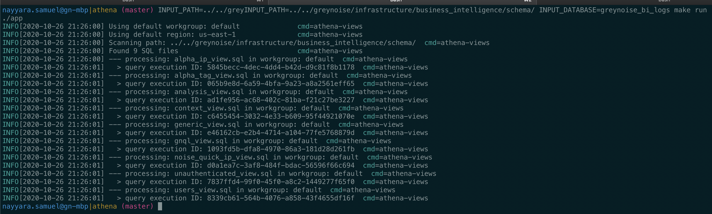

# Athena Github Action

This Github action scans a directory for Athena SQL files and executes them. These files should have statements to create views or other schema objects.

## Release

This action is a [Docker container Github action](https://docs.github.com/en/free-pro-team@latest/actions/creating-actions/creating-a-docker-container-action) and as such uses a docker container with the Go binary built from this project, as its entry point.
To avoid having to rebuild the Go binary everytime this action runs, the Dockerfile simply pulls down a pre-built Athena action binary from the releases of this repo. 

This means that if you make any changes to the Go code here, you must first do a release and upload the appropriate code and then modify the Dockerfile to use that release. While not the most straight-forward approach, it makes the execution of the Github action fast.

## Inputs

#### `path`

**Required** The path to scan for SQL files that contain Athena views. Only files that end with a `.sql` extension will be processed. 

#### `database`

**Required** The Athena database to create views in

#### `region`

**Optional** The AWS session region - defaults to `us-east-1`.

#### `workgroup`

**Optional** The AWS Athena workgroup to output views to.

## Outputs

#### `result`

The CLI output from executing Athena queries.

## Example usage

```yaml
on: [push]

jobs:
  refresh_views:
    runs-on: ubuntu-latest
    name: Refresh Athena views
    steps:
    - name: Generate Athena Views
      id: athena_views
      uses: GreyNoise-Intelligence/actions/athena@master
      with:
        path: infrastructure/bi/schema
        database: bi_db
      env:
          AWS_ACCESS_KEY_ID: ${{ secrets.AWS_ACCESS_KEY_ID }}
          AWS_SECRET_ACCESS_KEY: ${{ secrets.AWS_SECRET_ACCESS_KEY }}    
    - name: Example
      run: echo "The result was ${{ steps.athena_views.outputs.result }}"
```  

## Testing Locally

Requires AWS credentials set and Athena database (must exist). 

```bash 
export INPUT_PATH=xxx
export INPUT_DATABASE=xxx
make run 
```

##### Example Output


